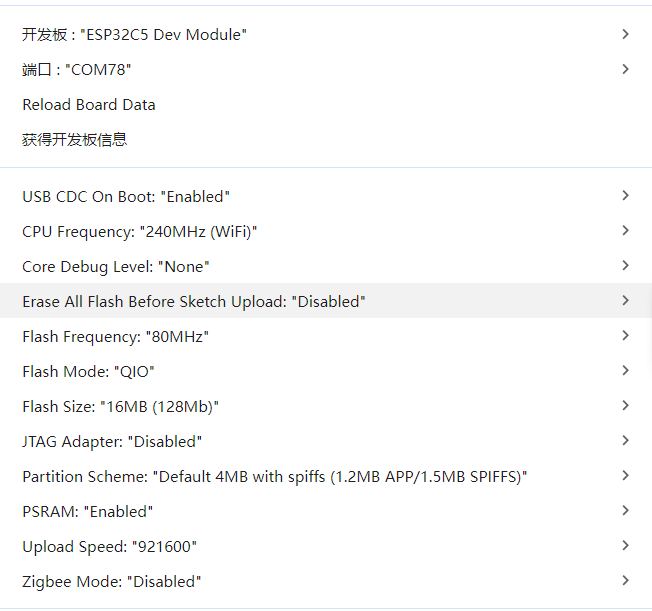
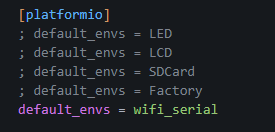
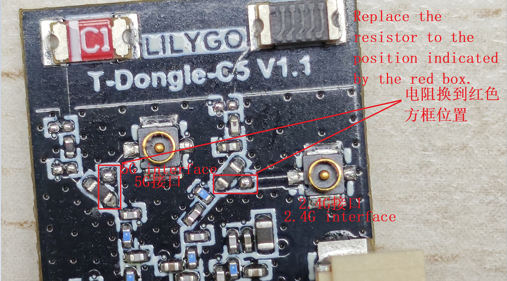

<h1 align = "center">🎯 T-Dongle-C5 🌐</h1>

## 🌈Introduction
>- This document was constructed and compiled by PlatformIO.

| board       | MCU         | WIFI   | BLE     | Display                  | storage | Flash | PSRAM | RGB(LED) | Button | USB   |
| ----------- | ----------- | ------ | ------- | ------------------------ | ------- | ----- | ----- | -------- | ------ | ----- |
| T-Dongle-C5 | ESP32-C5HR8 | WIFI 6 | BLE 5.0 | ST7735-80*160(0.96 inch) | SD      | 16MB  | 8MB   | APA102   | Boot   | USB-A |

## 🛵Directory
```
T-Dongle-C5
├── board           : T-Dongle-C5 board support
├── Examples
|   ├── Factory     : T-Dongle-C5 Factory Exampel
|   ├── SDCard      : SD card Exampel
|   ├── LCD         : SPI LCD demo
|   ├── LED         : LED demo
|   ├── wifi_serial : TCP URAT
├── Hardware
│   ├── T-Dongle-C5.pdf : T-Dongle-C5 hardware design
├── firmware ：T-Dongle-C5 firmware
├── firmware_bin ：The bin file is compiled and generated by extra_script.py.
├── doc ：ESP32C5 datasheet and peripheral datasheet
|   
├── readme.md
```

## 🚩Pinout Diagram
| GPIO    | LCD      | LED    | SD     | UART     | Button | USB    |
| ------- | -------- | ------ | ------ | -------- | ------ | ------ |
| GPIO_2  | LCD_MOSI |        | SD_CMD |          |        |        |
| GPIO_4  |          | LED_CI |        |          |        |        |
| GPIO_5  |          | LED_DI |        |          |        |        |
| GPIO_7  | LCD_MISO |        | SD_D0  |          |        |        |
| GPIO_6  | LCD_SCK  |        | SD_CLK |          |        |        |
| GPIO_10 | LCD_CS   |        |        |          |        |        |
| GPIO_3  | LCD_RS   |        |        |          |        |        |
| GPIO_0  | LCD_BL   |        |        |          |        |        |
| GPIO_1  | LCD_RST  |        |        |          |        |        |
| GPIO_23 |          |        | SD_CS  |          |        |        |
| GPIO_28 |          |        |        |          | BOOT   |        |
| GPIO_11 |          |        |        | UART0_TX |        |        |
| GPIO_12 |          |        |        | UART0_RX |        |        |
| GPIO_13 |          |        |        |          |        | USB_DN |
| GPIO_14 |          |        |        |          |        | USB_DP |

## ⚙️Quick Start
> Arduino:
>- Copy all files in the lib folder to `\Arduino\libraries`
>- Select the settings as shown. Note that the FLASH size partition and size may be modified depending on the board.


> ESP-IDF:
>- The IDF installation method is also inconsistent depending on the system, it is >-recommended to refer to the [official manual](https://docs.espressif.com/projects/esp-idf/en/latest/esp32/get-started/index.html) for installation

> PlatfromIO:
> - PlatformIO plug-in installation: Click on the extension on the left column -> search platformIO -> install the first plug-in
> - Click platformio.ini file -> seclect example -> bulid -> upload


| software   | supported | version          |
| ---------- | --------- | ---------------- |
| ESP-IDF    | ✅         | v5.5 or higher   |
| Arduino    | ✅         | v3.3.0 or higher |

## 🚀FAQ 
### 1.How to operate when using an external antenna?
>- 
